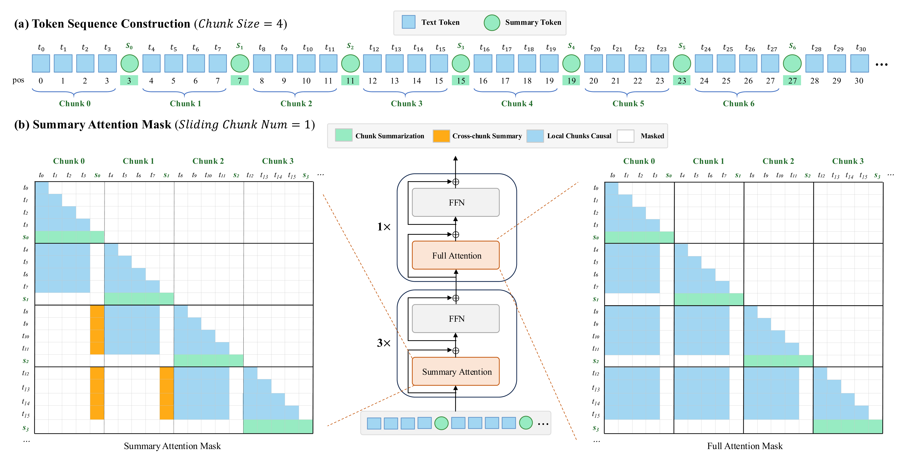
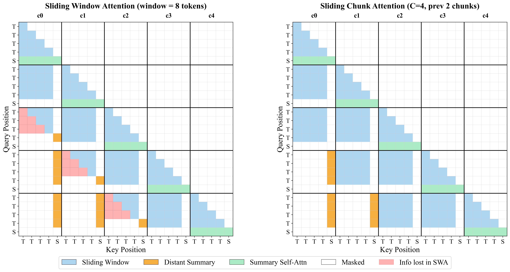
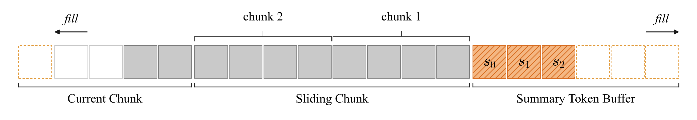
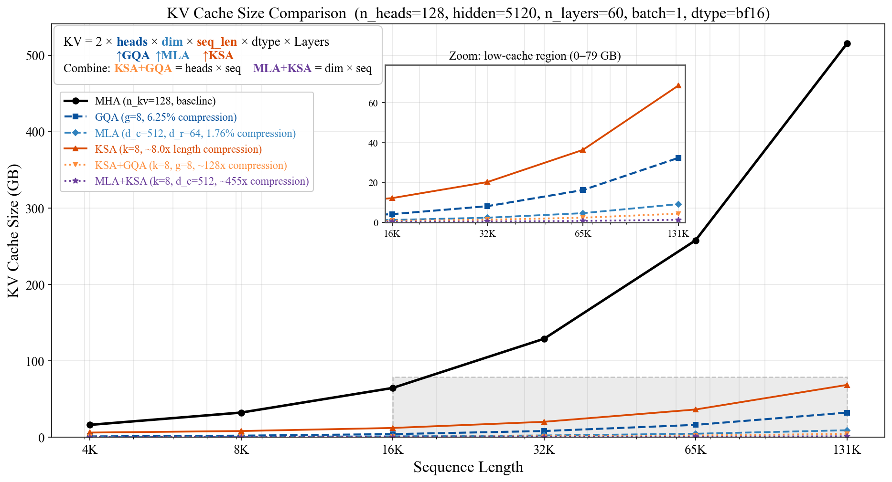

<div align="center">
  <h1>Kwai Summary Attention (KSA)</h1>
  <p align="center">
    <strong>基于可学习 Summary Token 的高效长上下文建模</strong>
  </p>
  <p align="center">
    <a href="https://arxiv.org/abs/2604.24432">
        
    </a>
    <a href="https://github.com/Kuaishou-OneRec/KSA">
        
    </a>
    <a href="#-许可证">
        
    </a>
  </p>
  <p align="center">
    <a href="README.md">English</a> | <a href="README_zh.md">中文</a>
  </p>
</div>
<br>

## 📖 简介

**Kwai Summary Attention（KSA）** 是一种高效注意力机制，在固定 chunk 边界插入少量 *可学习 Summary Token*，把历史上下文压缩到一组紧凑的状态里。GQA/MLA 会保留每个 token 的 KV cache，SWA / 线性注意力则直接丢弃或有损压缩远端历史；KSA 走的是 **中间路线** —— KV cache 以语义级压缩比 R 按 **O(N/R)** 规模增长，用少量显存换来 *完整、可回溯、可解释* 的长程依赖。

本仓库提供：

- **Muse** 训练框架与 Qwen3 + Summary Attention 模型实现。
- 训练 / prefill 阶段的块稀疏 **kernel**（已打包为 wheel）。
- 解码阶段的 **ring-buffer KV cache**，以 HuggingFace `trust_remote_code` 模板形式发布。
- 一份把 Qwen3-1.9B 基座从 8k → 32k → 64k → 128k 渐进式扩展的 **端到端 pretraining recipe**。
- DCP → HuggingFace safetensors 的 **权重转换脚本** 与推理自测脚本。

<p align="center"></p>
<p align="center"><em>图：KSA 混合架构。Summary Token 与 Text Token 交织；Summary Attention 与 Full Attention 层按 3:1 比例堆叠。</em></p>

## 🔥 新闻

- **2026-04-28** —— KSA 技术报告已发布于 arXiv：[arXiv:2604.24432](https://arxiv.org/abs/2604.24432)。
- **2026-04-28** —— 训练代码、recipe、块稀疏 kernel 与 HuggingFace `trust_remote_code` 模板在本仓库开源。

## ✨ 核心特性

- **序列级 KV 压缩。** Summary Token 将序列切分成大小为 $N$ 的 chunk，每个 chunk 的 Summary 作为远端历史的压缩先验。KV cache 增长从 $O(N)$ 变为 $O(N/R)$,并且与 GQA/MLA **正交** —— 各路压缩比相乘。
- **滑动 *Chunk* 而非滑动 *Window*。** 窗口边界对齐 chunk 边界,保证每个历史 chunk 要么整块可见(文本),要么以 Summary 形式可见,永不出现"部分重叠"的夹缝区 —— 这是朴素 SWA 在边界处丢信息的根源。
- **默认 Hybrid 结构。** 发布的 recipe 采用 `3:1` 的 *Summary : Full* 层间交织。少量 Full Attention 层充当跨 chunk 的信息整合通道,对长上下文检索稳定性至关重要。
- **解码阶段 Summary KV Cache。** KV 状态以单一连续 buffer 布局 `[scratch | current chunk | sliding chunks (ring) | summary buffer]`,每步解码只读一段连续切片 —— 不需要 `cat`、不需要 `gather`、不需要显式构造稠密 mask。详见 [`examples/pretrain/hf_template/modeling_qwen3sa.py`](examples/pretrain/hf_template/modeling_qwen3sa.py)。
- **训练/Prefill 用块稀疏 kernel。** 只把非零 block pair 从 HBM 搬到 SRAM,避开 $O(L^2)$ 的稠密 mask(否则 128k 根本跑不起)。已打包为 wheel,见 [`summary_attention_kernel/`](summary_attention_kernel/)。
- **三阶段训练 recipe。** Attention 蒸馏 → 参数退火 → 长度扩展,可通过 `run_pretrain_{8,32,64,128}k.sh` 直接复现。

## 🤖 Model Zoo

*Coming soon.* 技术报告正式发布时,将在 Hugging Face 同步放出预训练 checkpoint。

| 模型          | Backbone    | 参数量 | Context | 训练方式              | 链接  |
| :------------ | :---------- | :----- | :------ | :-------------------- | :---- |
| KSA-4B (CPT)  | Qwen3-4B    | 4B     | 128k    | Continual Pretraining | *TBD* |

1.9B *from-scratch* 配置只作为可复现的训练 recipe 提供,不会发布对应权重。

## 🏗️ 方法与架构

KSA 在 *语义* 层面压缩长上下文 —— 在固定 chunk 边界插入少量 **可学习 Summary Token**,然后把历史作为 chunk 序列处理,每个 chunk 要么以原始文本暴露,要么只留下它的 Summary 状态。

### 1. Sliding Chunk Attention

<p align="center"></p>
<p align="center"><em>图:滑动 chunk 注意力让窗口边界与 chunk 边界对齐。朴素滑窗会切穿 chunk 丢边界信息。</em></p>

当窗口边界切穿某个 chunk 时,这个 chunk 既没被文本 token 完整覆盖,也不能算作"已被 Summary 代表"的远端 chunk —— 信息就从缝里漏掉了。KSA 让窗口按 chunk 粒度滑动,每个历史 chunk *要么* 整块以文本形式可见(在窗口内),*要么* 只以 Summary 形式可见(在窗口外),不重复也不遗漏。

### 2. Ring-buffer KV Cache

<p align="center"></p>
<p align="center"><em>图:解码阶段 KV cache 布局。每个逻辑分区都是同一块物理 tensor 的连续切片。</em></p>

scratch / current chunk / sliding ring / summary buffer 都是同一块物理 tensor 的连续切片。文本 attention 和 summary attention 各读一段即可。由于 RoPE 在进 cache 之前就已经施加,环形 buffer 里的物理位置与逻辑位置解耦。chunk eviction 是一次原地 copy,不需要重分配、不需要 concat、不需要稠密 mask。

### 3. 次线性 KV 增长

<p align="center"></p>
<p align="center"><em>图:KV cache 随序列长度的增长曲线。</em></p>

### 4. 训练 Recipe

每个目标长度(8k → 32k → 64k → 128k)下,都循环执行三阶段:

1. **Attention 蒸馏** —— 用 Full-Attention teacher warm-up Summary Attention 参数。
2. **参数退火** —— 解冻全模型联合优化。
3. **长度扩展** —— 扩大 `max_position_embeddings`，调整 RoPE base 后继续训练。

每阶段具体超参见 [`examples/pretrain/README.md`](examples/pretrain/README.md)。

### 发布模型配置

本次发布包含两套 recipe：1.9B hybrid 从零训练（仅配方，不发布权重），以及 4B Continual Pretraining 版本。

| 配置项                         | From Scratch (1.9B)  | Continual Pretraining (4B) |
| :----------------------------- | :------------------- | :------------------------- |
| 层数                           | 24                   | 36                         |
| Hidden size                    | 2048                 | 2560                       |
| Intermediate size              | 6144                 | 9728                       |
| Attention heads (Q / KV)       | 16 / 16              | 32 / 8                     |
| Head dimension                 | 128                  | 128                        |
| Hybrid 比例 (Summary : Full)   | 3 : 1                | 3 : 1                      |
| Summary chunk size             | 8                    | 8                          |
| Sliding chunk number           | 128                  | 128                        |
| Tied embeddings                | False                | True                       |

配置文件位于 [`examples/pretrain/model_config/model_config_1b9_hybrid.json`](examples/pretrain/model_config/model_config_1b9_hybrid.json),通过 `muse/models/` 中注册的 `Qwen3SummaryAttentionConfig` / `Qwen3SummaryModel` 加载。

## 📈 实验结果

我们在两个设定下评估 KSA：从 Qwen3-4B-base 出发的 **Continual Pretraining (CPT，85B tokens)**，以及 **从零训练 (1.9B，400B tokens)**。完整结果见[技术报告](https://arxiv.org/abs/2604.24432)，下面摘录其中的关键数据。

### 长上下文检索 —— RULER（CPT, 4B）

| Benchmark   | Full      | Hybrid-SWA | Hybrid-SCA | Hybrid-Linear | KSA   | **Hybrid-KSA** |
| :---------- | :-------- | :--------- | :--------- | :------------ | :---- | :------------- |
| RULER-4K    | 92.88     | 91.30      | 86.02      | 86.39         | 91.55 | **92.97**      |
| RULER-8K    | **91.38** | 88.03      | 84.28      | 83.86         | 86.78 | 90.53          |
| RULER-16K   | **89.12** | 82.87      | 80.67      | 78.06         | 84.78 | 88.86          |
| RULER-32K   | 84.74     | 78.94      | 76.89      | 76.48         | 80.30 | **86.65**      |
| RULER-64K   | **78.16** | 73.88      | 68.88      | 73.50         | 76.09 | 76.04          |
| RULER-128K  | 65.86     | 66.27      | 60.94      | 67.98         | 66.81 | **71.67**      |

Hybrid-KSA 在 4K / 32K / 128K 三档取得最佳，**128K 上比 Full attention 高 +5.81 分**，同时 KV cache 占用显著更小。横跨所有 RULER 长度，它都是与 Full attention 差距最小的次二次方变体。

### 通用能力（CPT, 4B）

| Benchmark | Full      | Hybrid-SWA | Hybrid-SCA | Hybrid-Linear | KSA   | **Hybrid-KSA** |
| :-------- | :-------- | :--------- | :--------- | :------------ | :---- | :------------- |
| MMLU      | **71.83** | 70.57      | 69.83      | 64.33         | 70.73 | 70.50          |
| CMMLU     | **75.00** | 73.69      | 72.59      | 68.41         | 73.29 | 72.63          |
| C-Eval    | **73.66** | 72.36      | 71.66      | 67.42         | 72.14 | 72.66          |
| MMLU-Pro  | **46.36** | 45.23      | 45.11      | 38.83         | 45.70 | 45.39          |
| CMath     | 83.41     | **84.84**  | 83.16      | 79.09         | 84.58 | 84.25          |
| GSM8K     | **82.75** | 81.92      | 80.10      | 72.44         | 81.09 | 79.50          |
| MATH      | 47.48     | **48.24**  | 47.45      | 42.57         | 48.15 | 47.56          |
| MBPP      | 61.30     | 61.70      | 59.60      | 55.30         | 61.50 | **62.20**      |
| HumanEval | 58.54     | 61.89      | 61.89      | 54.58         | 60.97 | **62.50**      |
| **均值**  | 73.50     | 72.12      | 69.94      | 67.28         | 72.30 | **73.59**      |

CPT 设置下 KSA 完整保留了通用能力 —— Hybrid-KSA 平均 **73.59，反超 Full attention 的 73.50**，是所有次二次方变体中与 Full 差距最小的。

### 从零训练（1.9B，400B tokens）

- **RULER-128K**：Hybrid-KSA **65.35** vs. Full **48.75**（**+16.60**）。Hybrid-KSA 随长度增长保持稳定（4K→128K：80.65→65.35），Full attention 则严重退化（76.08→48.75）。
- **GSM8K**：Hybrid-KSA **59.14** vs. Full **48.29**（**+10.85**）。**MATH**：**36.92** vs. **23.38**（**+13.54**）。
- **MBPP / HumanEval**：所有配置最佳，**36.40 / 31.71**。
- **训练 Loss**：Hybrid-KSA 收敛到最低 loss（**1.524**），低于 Hybrid-GDN（1.534）、Hybrid-SWA（1.550）、Full（1.572）。

### Needle-in-a-Haystack 与 RULER-128K 子任务（CPT）

Hybrid-KSA 在 4K–128K 全长度、全 needle 深度下接近满分单针检索，仅 128K 处略有微降。RULER-128K 子任务上：**NIAH-Multivalue 98.75（比 Full 高 +10.63）**、**VT 90.50（比 Full 高 +30.0）**、**FWE 65.84**、**SQuAD 42.50** 均处于领先。

### 推理效率（4B, 128K）

- **KV cache**：7.5 GB vs. Full attention 18.6 GB —— **2.5× 压缩**。
- **解码吞吐**（16K prefill）：**1.06× of Full**，而 Hybrid-SWA 仅 0.73×、Hybrid-Ring-Linear 仅 0.81×。

## 🚀 快速开始

### 1. 构建参考镜像

Ubuntu 24.04 + CUDA 12.6 + Python 3.12 + PyTorch 2.6.0 + FlashAttention 2.7.4.post1,并预装块稀疏 kernel:

```bash
docker build -t ksa-train -f dockerfile/Dockerfile .
```

版本号来自真实训练机的 snapshot,完整列表见 [`dockerfile/requirements.txt`](dockerfile/requirements.txt)。偏好裸机部署时对齐同一份 pin 即可。

### 2. 配置环境变量

```bash
cp .env.example .env      # 修改路径
bash set_env.sh
```

run 脚本会自动 `export PYTHONPATH=$PWD:$PYTHONPATH`,把仓库根目录挂到 `PYTHONPATH` 就够了。

### 3. Pretrain(渐进式长度扩展)

四个阶段,每阶段在上一阶段权重基础上续训:

```bash
bash examples/pretrain/run_pretrain_8k.sh     # 1. 从零训 8k
bash examples/pretrain/run_pretrain_32k.sh    # 2. 扩到 32k
bash examples/pretrain/run_pretrain_64k.sh    # 3. 扩到 64k
bash examples/pretrain/run_pretrain_128k.sh   # 4. 扩到 128k
```

每个脚本顶部的 `CHECKPOINT_DIR` / `OUTPUT_DIR` 需要按你的存储路径调整。阶段通过 `mpirun` 启动,DCP checkpoint 和 dataloader 状态都落到 `$OUTPUT_DIR/global_stepN/`。中途 resume、chunked-CE 开关、各阶段超参详见 [`examples/pretrain/README.md`](examples/pretrain/README.md)。

### 4. 转换为 HuggingFace 格式

```bash
bash examples/pretrain/convert/convert_muse_to_hf.sh \
     /path/to/muse_outputs/1b9_sa_hybrid_128k \
     global_step5000 \
     examples/pretrain/hf_template
```

转换结果落在 `<OUTPUT_DIR>/<STEP>/hf/`,除了 remap 后的 safetensors,还会从 `hf_template/` 拷入 `modeling_qwen3sa.py` / `summary_context.py` / tokenizer 等。模板所需内容见 [`examples/pretrain/hf_template/README.md`](examples/pretrain/hf_template/README.md)。

### 5. 推理 —— 跑一次生成验证模型

```bash
python examples/inference/inference.py \
     --model_path /path/to/global_step5000/hf \
     --prompt "介绍一下你自己" \
     --device cuda:0
```

推理直接走 HuggingFace `AutoModelForCausalLM` + `trust_remote_code=True`,底层使用 `hf_template/modeling_qwen3sa.py` 中定义的 ring-buffer KV cache,无需额外框架胶水。

## 📁 仓库结构

```
.
├── muse/                           # 训练框架(models / layers / training loop)
│   ├── models/qwen3_sa/            # Qwen3 + Summary Attention 模型
│   ├── layers/summary_context.py   # SummaryBatchContext + mask 工具
│   └── ...
├── recipes/
│   └── pretrain_kai_summary_unified.py   # Pretrain 主入口
├── summary_attention_kernel/
│   ├── summary_attn-*.whl          # 块稀疏 SA kernel(训练 + prefill)
│   └── flash_attn_cute-*.whl       # kernel 依赖的 CuTe FlashAttention 构建
├── examples/
│   ├── pretrain/                   # 8k → 128k 渐进式 recipe
│   │   ├── model_config/           # model_config_1b9_hybrid.json
│   │   ├── dataset_config/         # 各 seq len 的 mmap 数据集描述
│   │   ├── run_pretrain_{8,32,64,128}k.sh
│   │   ├── convert/                # DCP → HF safetensors
│   │   └── hf_template/            # HF 兼容 modeling + config 模板
│   └── inference/
│       └── inference.py            # chat-style 快速自测
├── data/                           # (自行准备)mmap 语料
├── dockerfile/                     # 参考 Dockerfile + requirements.txt
└── README.md / README_zh.md
```

## 🛣️ Roadmap

正在推进:

- [x] 技术报告上 arXiv（[arXiv:2604.24432](https://arxiv.org/abs/2604.24432)）。
- [x] 放出 4B Continual Pretraining recipe 与 checkpoint。
- [x] 更多消融与教程。
- [x] 内置 ring-buffer KV cache 的参考推理/Serving 栈。
- [ ] RULER / NIAH / LongBench v2 复现脚本。


欢迎 issue / PR。

## 📜 引用

如果 KSA 对你的工作有帮助，请引用我们的技术报告：

```bibtex
@techreport{kwai2026ksa,
  title       = {Kwai Summary Attention Technical Report},
  author      = {OneRec Team},
  year        = {2026},
  institution = {Kuaishou Technology},
  url         = {https://arxiv.org/abs/2604.24432}
}
```

## 🛡️ 许可证

本仓库代码基于 **Apache License 2.0** 发布,详见 [`LICENSE`](LICENSE)。模型权重开放后将遵循各自的 License。

## 🙏 致谢

KSA 构建在开源生态之上。感谢:

- **Qwen3** —— 提供 KSA 扩展所依赖的基座架构与 tokenizer。
- **FlashAttention** —— 我们块稀疏 kernel 背后的 dense attention 原语。
- **HuggingFace Transformers** —— 模型 / tokenizer / generation 抽象让 `trust_remote_code` 部署无缝衔接。
- **PyTorch 分布式训练** —— FSDP、DCP 与通信原语是大规模预训练的基石。

由衷感谢这些项目的出色工作。
